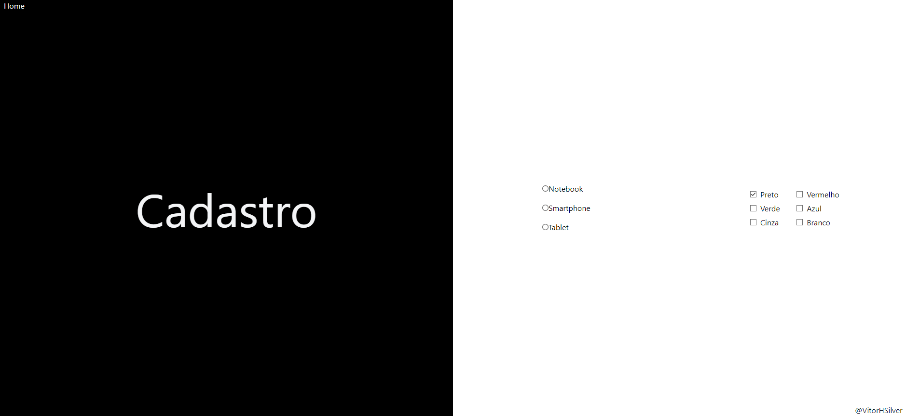

# Aprendendo React - Inputs de Radio e Checkbox

## Visão Geral

Este projeto demonstra o uso de inputs de radio e checkbox em uma aplicação React. Os inputs de radio permitem que o usuário selecione uma opção de um conjunto, enquanto os inputs de checkbox permitem que o usuário selecione múltiplas opções.

## Inputs de Radio

Os inputs de radio são usados quando você quer que o usuário selecione uma opção de um conjunto. Neste exemplo, o usuário pode selecionar entre "Notebook", "Smartphone" e "Tablet".

```jsx
const [radio, setRadio] = React.useState('');


-    `RadioChange`: Esta função atualiza o estado `radio` quando um input de radio é selecionado.

const RadioChange = ({ target }) => {
     setRadio(target.value);
};

<label>
     <input
                    type="radio"
                    name="produto"
                    value="notebook"
                    checked={radio === 'notebook'}
                    onChange={RadioChange}
     />
     Notebook
</label>
<label>
     <input
                    type="radio"
                    name="produto"
                    value="smartphone"
                    checked={radio === 'smartphone'}
                    onChange={RadioChange}
     />
     Smartphone
</label>
<label>
     <input
                    type="radio"
                    name="produto"
                    value="tablet"
                    checked={radio === 'tablet'}
                    onChange={RadioChange}
     />
     Tablet
</label>
```

## Inputs de Checkbox

Os inputs de checkbox são usados quando você quer que o usuário selecione múltiplas opções de um conjunto. Neste exemplo, o usuário pode selecionar múltiplas cores.

```jsx
const [cores, setCores] = React.useState(['black']);

-    `handleChangeColor`: Esta função atualiza o estado `cores` quando um checkbox é marcado ou desmarcado.
/*
Usa o método filter para criar um novo array sem a cor desmarcada.
A função de callback (cor) => cor !== target.value retorna true para todas as cores que são diferentes de target.value.
Atualiza o estado cores com o novo array resultante.
*/
const handleChangeColor = ({ target }) => {
     if (target.checked) {
          setCores([...cores, target.value]);
     } else {
          setCores(cores.filter((cor) => cor !== target.value));
     }
};
-    `checkColor`: Esta função verifica se uma cor está incluída no estado `cores`.
// considerando que o usuário tem um preferencia, pegamos a cor de preferencia e
//comparamos com o valor passado de parametro
const checkColor = (cor) => {
     return cores.includes(cor);
};

<label>
     <input type="checkbox" value="black" className="m-2" checked={checkColor('black')} onChange={handleChangeColor} />
     Preto
</label>;
```

### Gerenciamento de Estado

-    `radio`: Este estado guarda o valor do input de radio selecionado.
-    `cores`: Este estado guarda um array de cores selecionadas.

### Reatividade no texto e background

```jsx
import React from 'react';
import './App.css';

const App = () => {
     // Background de preferência vem como black
     const [cores, setCores] = React.useState(['black']);

     // Array para incluir reatividade no tailwind
     // traduzindo os atributos para tailwind
     const coresMap = {
          black: 'bg-black',
          white: 'bg-white',
          blue: 'bg-blue-800',
          red: 'bg-red-700',
          green: 'bg-green-900',
          yellow: 'bg-yellow-200',
          gray: 'bg-gray-400',
     };

     return (
          <div className="grid grid-cols-2 h-screen">
               <div className={`grid h-screen place-items-center ${cores.map((cor) => coresMap[cor])}`}>
                    <span className="text-gray-100 top-0 left-0 absolute ml-2">Home</span>
                    <span className="text-gray-900 absolute top-210 left-443 ">@VitorHSilver</span>
                    <h2 className="text-8xl text-gray-100 capitalize">{radio ? radio : 'Cadastro'}</h2>
               </div>
          </div>
     );
};

export default App;
```

Este código fornece uma maneira simples e interativa de aprender sobre inputs de radio e checkbox no React.


