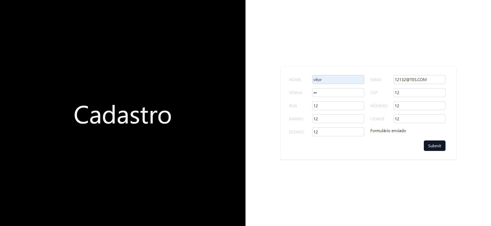

# Projeto Learning React

## Visão Geral

Este projeto demonstra uma aplicação simples em React que inclui um formulário para registro de usuários. O formulário coleta vários detalhes do usuário e os envia para um endpoint da API usando o método `fetch`.

## Funcionalidades

-    **Manipulação de Formulário**: O formulário inclui campos para nome, email, senha e detalhes de endereço.
-    **Gerenciamento de Estado**: Utiliza o hook `useState` do React para gerenciar os dados do formulário e o estado da resposta.
-    **Interação com API**: Envia os dados do formulário para um endpoint da API usando o método `fetch`.

## Explicação do Código

### Estado do Formulário

O estado do formulário é gerenciado usando o hook `useState`. O estado inicial inclui campos para nome, email, senha e detalhes de endereço.

```javascript
const [form, setForm] = React.useState({
     nome: '',
     email: '',
     senha: '',
     cep: '',
     rua: '',
     numero: '',
     bairro: '',
     cidade: '',
     estado: '',
});
```

### Campos de Entrada

Os campos de entrada são gerados dinamicamente a partir de um array de configurações de entrada. Cada campo de entrada atualiza o estado do formulário usando a função `handleChange`.

```javascript
const inputs = [
     { id: 'nome', label: 'Nome', type: 'text' },
     { id: 'email', label: 'Email', type: 'email' },
     { id: 'senha', label: 'Senha', type: 'password' },
     { id: 'cep', label: 'CEP', type: 'text' },
     { id: 'rua', label: 'Rua', type: 'text' },
     { id: 'numero', label: 'Número', type: 'text' },
     { id: 'bairro', label: 'Bairro', type: 'text' },
     { id: 'cidade', label: 'Cidade', type: 'text' },
     { id: 'estado', label: 'Estado', type: 'text' },
];
```

### Manipulação de Mudanças nos Campos

A função `handleChange` atualiza o estado do formulário quando o valor de um campo de entrada é alterado.

```javascript
const handleChange = ({ target }) => {
     const { id, value } = target;
     setForm({ ...form, [id]: value });
};
```

### Submissão do Formulário

A função `handleSubmit` lida com a submissão do formulário. Ela previne o comportamento padrão de submissão do formulário e envia os dados do formulário para o endpoint da API usando o método `fetch`.

```javascript
const handleSubmit = async (event) => {
     event.preventDefault();

     try {
          const response = await fetch('https://ranekapi.origamid.dev/json/api/usuario', {
               method: 'POST',
               headers: {
                    'Content-Type': 'application/json',
               },
               body: JSON.stringify(form),
          });

          // Atualiza o estado com a resposta da API
          setResponse(response);

          // Verifica se a requisição foi bem-sucedida
          if (response.ok) {
               console.log('Formulário enviado com sucesso!');
               console.log(response);
          } else {
               console.error('Erro ao enviar o formulário:', response.statusText);
          }
     } catch (error) {
          console.error('Erro na requisição:', error);
     }
};
```

### Renderização do Formulário

O formulário é renderizado com um botão de submissão. Se a resposta for bem-sucedida, uma mensagem de confirmação é exibida.

```javascript
return (
     <div className="grid grid-cols-2 min-h-screen">
          <div className="grid bg-black h-screen place-items-center">
               <h2 className="text-8xl text-gray-100">Cadastro</h2>
          </div>
          <form
               onSubmit={handleSubmit}
               className="grid grid-cols-2 gap-4 p-8 w-full border border-gray-400/10 shadow max-w-2xl m-auto"
          >
               {inputs.map(({ id, label, type }) => (
                    <div key={id}>
                         <div className="grid grid-cols-[80px_auto] items-center">
                              <label className="text-gray-300 uppercase" htmlFor={id}>
                                   {label}
                              </label>
                              <input
                                   type={type}
                                   id={id}
                                   name={label}
                                   value={form[id]}
                                   onChange={handleChange}
                                   className="border mx-2 py-1 pl-1 border-gray-400/50 rounded-md"
                              />
                         </div>
                    </div>
               ))}
               {response && response.ok && <p>Formulário enviado</p>}
               <div className="flex justify-end col-span-2">
                    <button className="mx-2 py-2 px-4 bg-gray-900 text-gray-200 rounded-md place-content-end cursor-pointer">
                         Submit
                    </button>
               </div>
          </form>
     </div>
);
```

## Conclusão

Este projeto fornece um exemplo básico de manipulação de formulários no React, gerenciamento de estado e interação com uma API usando o método `fetch`. Ele serve como um bom ponto de partida para aprender a construir e gerenciar formulários em uma aplicação React.


